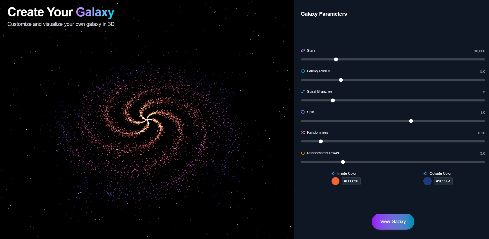

# 🌌 create-your-galaxy

Interactive web app to generate your own custom 3D galaxy in real time.



Adjust parameters like number of stars, size, spin, randomness, and colors — then visualize your galaxy in fullscreen. The configuration is passed via URL, so you can save and share your unique creation.

---

## 🔗 Live Demo

🌐 **Check it out here:**  
[https://create-your-galaxy.vercel.app/](https://create-your-galaxy.vercel.app/)

---

## 🚀 Tech stack

- ⚛️ [Next.js](https://nextjs.org/)
- 🧪 [TypeScript](https://www.typescriptlang.org/)
- 🌌 [Three.js](https://threejs.org/)
- 🎨 [@react-three/fiber](https://github.com/pmndrs/react-three-fiber)
- 🧩 [@react-three/drei](https://github.com/pmndrs/drei)

## 🧭 How it works

1. Choose your galaxy parameters from the UI (particles, radius, branches, color, etc).
2. Click "View Galaxy" to open the 3D scene in fullscreen mode.
3. Parameters are encoded in the URL — perfect for sharing.

## 🛠️ Local development

```bash
pnpm install
pnpm run dev
```
